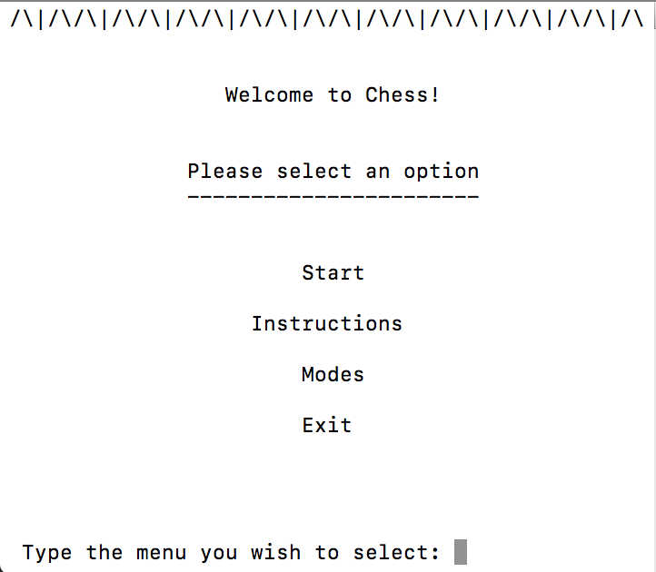
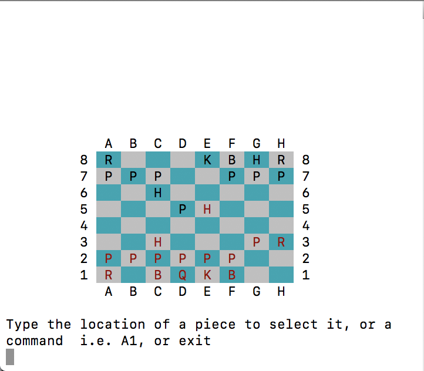
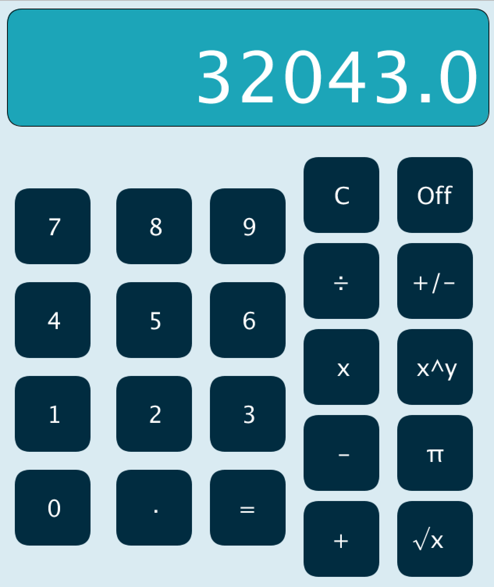
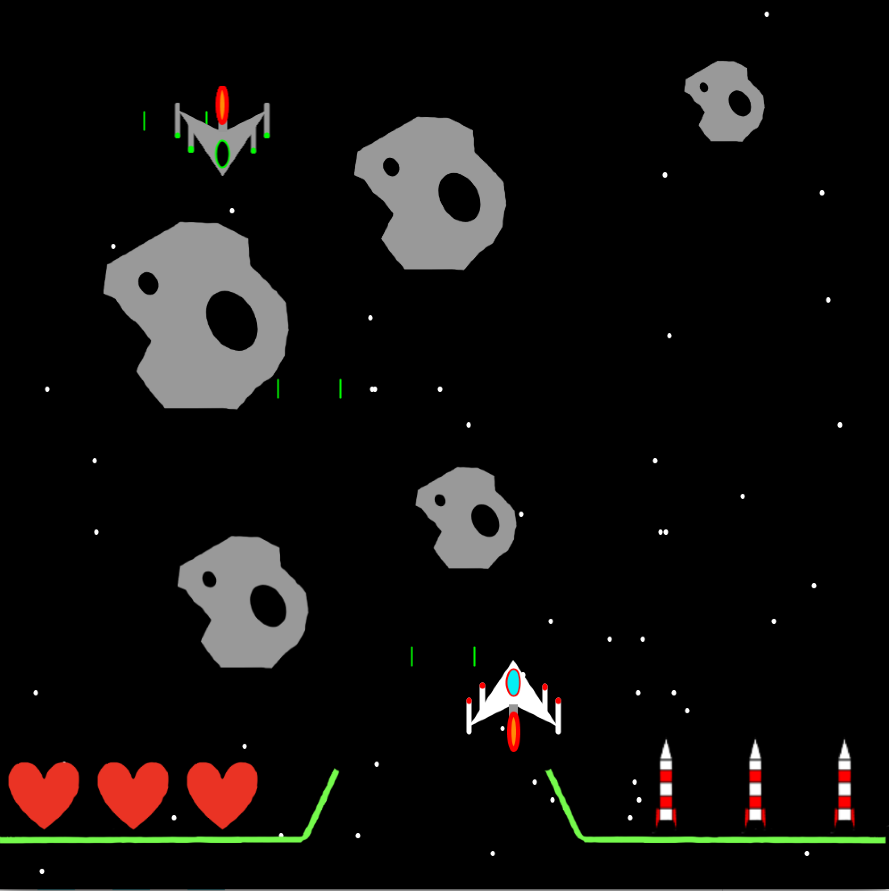
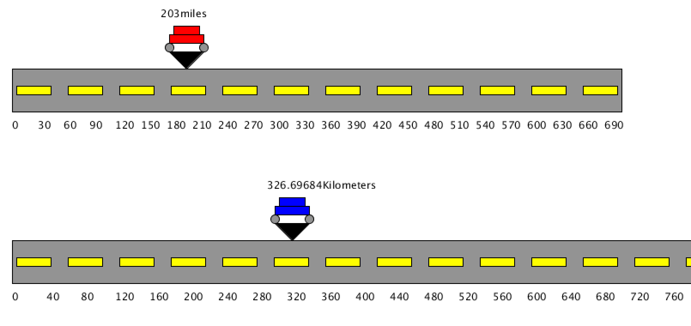

# Lucas Zagal's Programming Portfolio

A collection of projects that I have worked on, including both personal and group projects

**Contact me at:** gigakong18@gmail.com

Group Work
--------------

### Chess

    An ASCII based Chess game written in C++

[Source Code](https://github.com/Arcane-Panda/Chess/blob/master/source/main/chessMain.cpp) 

## Personal Projects

### Calculator

    A working calculator written in Processing

[Source Code](https://github.com/Arcane-Panda/calculator)

### Shape Calculator

    Calculates the area and volume of given shapes

[Source Code](https://github.com/Arcane-Panda/Shape-Calculator)

### Space Game

        A game similar to Galaga, featuring asteroids, missles, and enemies
    
[Source Code](https://github.com/Arcane-Panda/SpaceGame)

### Screensaver

        A simple and elegant screensaver

[Source Code](https://github.com/Arcane-Panda/ScreenSaver)

### Miles to Kilometers Converter

        Exactly what it sounds like, but with an appealing interface
       
[Source Code](https://github.com/Arcane-Panda/MilesToKilo)

