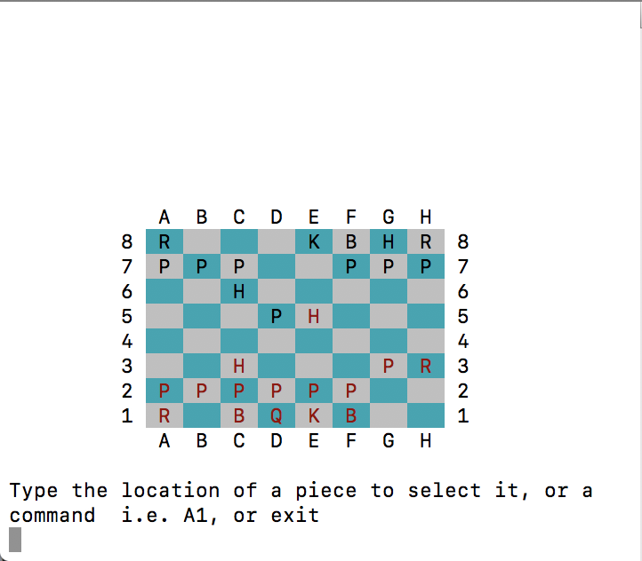

# Lucas Zagal's Programming Portfolio

A collection of projects that I have worked on, including both personal and group projects

**Contact me at:** gigakong18@gmail.com

## Group Work
### Chess

    An ASCII based Chess game written in C++

[Source Code](https://github.com/Arcane-Panda/Chess/blob/master/source/main/chessMain.cpp) 

## Personal Projects

### Calculator

    A working calculator written in Processing

[Source Code](https://github.com/Arcane-Panda/calculator)

### Shape Calculator

    Calculates the area and volume of given shapes

[Source Code](https://github.com/Arcane-Panda/Shape-Calculator)

